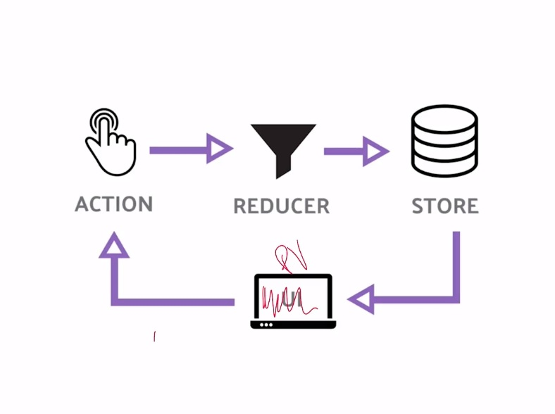

# Redux React Router - Platzi

## React Router 
React Router es un libreria para React, que nos permite manegar rutas, y una navegación fluida entre estas, obteniendo asi uno de los factores mas importantes de una SPA.
Los componentes que nos brinda principalpemte para esto son:
* BrowserRouter
* Switch
* Route
* Link
Y una que personalmente no conocia pero me parece muy importante
* withRoute
## Redux
Redux es una librería escrita en JavaScript, basada en la arquitectura Flux y creada por Dan Abramov, se basa en 3 principios fundamentales:
* Solamente hay una fuente de la verdad.
* El estado es de solo lectura.
* Solamente podemos utilizar funciones puras.
Nuestra UI va a activar una action, esta action va a ejecutar un reducer para modificar la información del store, y al actualizarse el store la UI se va a modificar.

Como Inegraremos Redux en nuestra app
